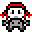

# Minimum Viable Product

## What is an MVP?

From Wikipedia:

> A minimum viable product has just those core features that allow the product to be deployed, and no more.

We will follow this definition, but instead of deployment, we will focus on 3 essential stages.

## Stage 1: Diamond in the Rough

Here's where it begins. We will handle this as a core group of functions and needs based off of user stories to get us a simple, barely functional product from which all other work is done. Big picture wise, this means getting our lovely [Gosu](https://github.com/jlnr/gosu/ "Our Render Library") integration up and running and our happy farmer Ruby running around. More specifically:

1. I expect to see the game on my screen and for it to update as events change.
2. I expect to see a title screen.
3. I expect to see a "field" screen.
⋅⋅* The field screen is a general term to describe the main interactive screen, aka, the map with sprites.
4. I expect to see the player as an animated sprite.
5. I expect to be able to move the player sprite around via input keys.
6. I expect to experience collision detection.
⋅⋅* Collision detection is the idea that you will eventually run into something through which you cannot pass.

With these 6 points complete, we move to stage 2.

## Stage 2: Cutting into Beauty

Once the most basic elements of the game are up and running from stage 1, we can expect to begin work on the actual elements of gameplay. This stage will likely involve significant work from all members, and will involve the production of additional media (sprites and map textures) to display new features. Each addition or edit will be logged in Github via issues, branched from main, with Pull Requests issued before pushing to live code. 

The purpose of this stage is to implement the crop system, the crop entities, and player actions. Concepts of time passing and player actions will be placed here, though nothing extensive is required. This is setting up the game system, not completing it. More specifically:

1. I expect there to be one crop with which the player can interact with:
⋅⋅1. I expect the crop to have four different life stages.
⋅⋅2. I expect the crop to accept different actions and react appropriately.
⋅⋅3. I expect the crop to be displayed through an animated sprite.
2. I expect the player to have a pool of energy to expend through actions.
3. I expect the player to be able to initiate 'day turn', marking the passage of time.
4. I expect the player's energy pool to reset each day.
5. I expect the player to move freely through the map and select which field tiles they desire to use.
6. I expect the map to have natural seeming elements that keep the player from colliding with actual borders.

## Stage 3: Polishing the Gem...farm

Once the core elements of the game have been implemented in Stage 2, we can now move on to emebellishments, cleaning, refactoring, and going as wild and crazy as desired. This is open ended but some suggestions to make the game more fun:

* Create multiple new crops, all of which require different input and actions to grow.
* Create separate house map with a bed for the day turn, with a journal that can track days and crop needs.
* Create animals to join in the farm fun.
* Add a shop with power ups.
* Add monetary rewards for success at market that can be used to purchase power-ups.
* Make market day interactive.
* Add random-generated events, both positive and negative.

If you've even made it to this point (reading, let alone code-wise!) then you're already a hero. Ruby would be proud of you.

